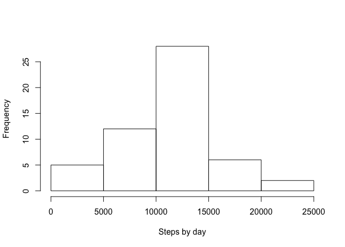
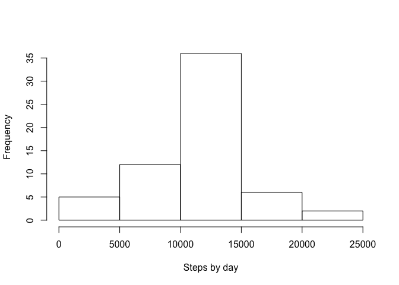

# Reproducible Research: Peer Assessment 1

## Loading and preprocessing the data
Here I load the libraries I will use in this assignemt, as well as the data, that will be called "walkData". I also get rid of NAs.


```r
library(dplyr)
```

```
## 
## Attaching package: 'dplyr'
```

```
## The following objects are masked from 'package:stats':
## 
##     filter, lag
```

```
## The following objects are masked from 'package:base':
## 
##     intersect, setdiff, setequal, union
```

```r
library(lattice)
unzip(zipfile = 'activity.zip', exdir = '.')

walkData = read.csv('activity.csv')
cleanData <- walkData[!is.na(walkData$steps),]
```


## What is mean total number of steps taken per day?

I calculate the total number of steps taken by day, and I show a histogram of frequencies of steps taken by day.


```r
groupByDay <- group_by(cleanData, date)
stepsByDay <- summarise(groupByDay, steps = sum(steps))

hist(stepsByDay$steps, xlab = 'Steps by day', main = '')
```

<!-- -->

Here you can see the mean and the median of the distribution of the total steps taken by day.

```r
mean(stepsByDay$steps)
```

```
## [1] 10766.19
```

```r
median(stepsByDay$steps)
```

```
## [1] 10765
```

## What is the average daily activity pattern?

This is the time-series plot of the number of steps taken.

```r
groupByInterval <- group_by(cleanData, interval)
stepsByInterval <- summarise(groupByInterval, steps = mean(steps))

plot(stepsByInterval$interval, stepsByInterval$steps, type = 'l', xlab = 'Interval', ylab = 'Average steps')
```

<!-- -->

And here you can find the interval with the highest number of steps taken:

```r
stepsByInterval[stepsByInterval$steps == max(stepsByInterval$steps), 'interval']
```

```
## # A tibble: 1 × 1
##   interval
##      <int>
## 1      835
```


## Imputing missing values
First, I calculate the number of NAs in the original data:

```r
sum(is.na(walkData$steps))
```

```
## [1] 2304
```

Then I impute the missing values by the mean of the interval they are in, and I plot the histogram of the total number of steps taken each day.

```r
naIndex <- which(is.na(walkData$steps))
imputedData <- merge(walkData, stepsByInterval, by = 'interval')
imputedData <- imputedData[with(imputedData, order(date)), ]

imputedData$steps <- ifelse(is.na(imputedData$steps.x), imputedData$steps.y, imputedData$steps.x)
imputedData <- imputedData[,c("date","interval","steps")]

groupByDayImputed <- group_by(imputedData, date)
stepsByDayImputed <- summarise(groupByDayImputed, steps = sum(steps))

hist(stepsByDayImputed$steps, xlab = 'Steps by day', main = '')
```

<!-- -->

These are the mean and the median of the new data set.

```r
mean(stepsByDayImputed$steps)
```

```
## [1] 10766.19
```

```r
median(stepsByDayImputed$steps)
```

```
## [1] 10766.19
```

As it can be found, the mean is not changing, and the median is almost the same. So the imputing method is not altering these values.


## Are there differences in activity patterns between weekdays and weekends?
Finally I show the time-series of the steps taken in both weekdays and wekends.

```r
imputedData$weekDay <-  weekdays(as.Date(imputedData$date))
imputedData$weekDay <- as.factor(ifelse(imputedData$weekDay %in% c("Saturday","Sunday"), "weekend", "weekday"))

groupByWeekdayImp <- group_by(imputedData, weekDay, interval)
stepsByWeekDay <- summarise(groupByWeekdayImp, steps = mean(steps))


xyplot(steps~interval|weekDay, data = stepsByWeekDay, type = "l", layout =c(1,2))
```

<!-- -->

The weekdays appear to have an earlier start of the activity, and also more intensity, but compared to the weekends, then it stays in low activity until late hours. Proabably the more active hours correspond to the time going to work/school and back home, while the rest of the day the activity is minimal. On the weekend the activity is more homogeneous, meaning that there is no constant pattern of activities.
